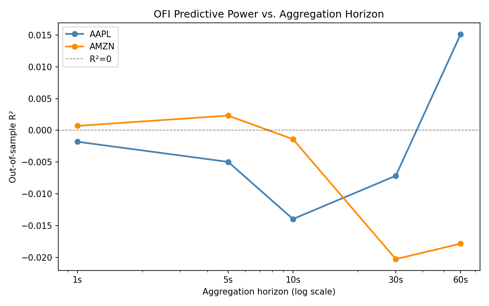

# lob-engine

A high-performance C++17 limit order book reconstruction engine for Nasdaq ITCH 5.0 binary feeds, with microstructure feature extraction and out-of-sample alpha research.

## Architecture

The pipeline is organized into four layers:

```
┌─────────────────────────────────────────────────────────┐
│  Layer 1 — Feed Parser   (include/feed/, src/feed/)     │
│  Reads raw ITCH 5.0 binary; emits typed message structs │
├─────────────────────────────────────────────────────────┤
│  Layer 2 — Order Book    (include/book/, src/book/)     │
│  Maintains bid/ask price levels as flat sorted arrays   │
│  (replaced std::map; –11% pipeline latency at depth 20) │
├─────────────────────────────────────────────────────────┤
│  Layer 3 — Feature Engine (include/features/, src/)     │
│  Computes OFI, bid-ask spread, and trade imbalance      │
│  on 1-second intervals; writes CSV for downstream use   │
├─────────────────────────────────────────────────────────┤
│  Layer 4 — Analysis      (scripts/analysis.py)          │
│  OLS regression of normalized OFI against future price  │
│  changes; reports in-sample and out-of-sample R²        │
└─────────────────────────────────────────────────────────┘
```

## Dependencies

- C++17-compatible compiler (Apple Clang ≥ 12, GCC ≥ 9)
- GNU Make
- Python 3 with `pandas`, `numpy`, `statsmodels` (for `scripts/analysis.py`)

No third-party C++ libraries are required.

## Build

```bash
make          # produces ./lob_engine
make clean    # remove build/ and binary
```

The Makefile uses `-O2 -std=c++17` and auto-tracks header dependencies via `-MMD -MP`, so incremental builds only recompile what changed.

## Usage

```bash
./lob_engine <itch_file.bin> <TICKER> <output.csv>
```

**Example:**

```bash
./lob_engine data/01302020.NASDAQ_ITCH50 AAPL data/features_AAPL.csv
```

The engine will print a progress summary on exit:

```
Done.
  Messages processed:  226000000
  Trades:              1840312
  Feature rows:        23400
  Elapsed:             29.0s
  Throughput:          7.8M msg/s

Features written to: data/features_AAPL.csv
```

**Note:** the 226M messages / 7.8M msg/s / 29.0s figures above are pending re-verification —
no raw ITCH file is currently available locally to rerun this end-to-end measurement. This is
an aggregate wall-clock figure, unaffected by the per-op benchmark harness issue described
below; it is simply unconfirmed on this machine since the last audit. See
[`bench/BASELINE.md`](bench/BASELINE.md) for detail.

Then run the regression analysis:

```bash
python3 scripts/analysis.py data/features_AAPL.csv
```

## Benchmark Results

Measured on Apple Silicon (arm64), single core, release build (`-O2`), via the grouped-batch
harness described in [Benchmark methodology](#benchmark-methodology) below. Full detail,
methodology, and reproduction steps: [`bench/BASELINE.md`](bench/BASELINE.md).

Headline figure — `BM_FullPipeline` (the dominant message type, ~60% of ITCH traffic):

| Metric | Value |
|---|---|
| Mean per-message latency | 17.17 ns |
| Median (p50) per-message latency | 16.93 ns |
| Grouped-batch p99 (128-op window) | 22.46 ns |
| Grouped-batch p999 (128-op window) | 45.90 ns |
| Messages processed (end-to-end, pending re-verification) | 226M |
| Throughput (end-to-end, pending re-verification) | 7.8M msg/s |

The flat sorted-array book representation eliminates pointer-chasing and improves cache
locality at the common case of 5–20 active price levels per side; see `bench/BASELINE.md`
Phase 4 for the measured effect of the pool-allocator fix on `orders_` lookup.

## Benchmark methodology

Per-op timing on this hardware is quantized to the platform's measured ~41.667ns timer tick
(`mach_timebase_info` numer=125 denom=3, confirmed empirically — there is no userspace cycle
counter available on Apple Silicon). The harness therefore times 128-op groups with 500 warmup
groups discarded per run, rather than timing single operations directly. Reported percentiles
are consequently percentiles of *per-op-equivalent group means*, not single-operation
percentiles — a real tail event in one op is damped, not eliminated, by averaging over its
128-op window. See [`bench/BASELINE.md`](bench/BASELINE.md) for the full derivation, rationale,
and acceptance test.

## Research Results

All regressions use a time-series 70/30 train/test split (first 70% of the trading day for training, final 30% for out-of-sample evaluation). N ≈ 55,600 second-level observations per ticker.

---

### Iteration 1 — Baseline: Raw OFI vs. 1-Second Forward Returns

The first experiment replicates the core result of Cont, Kukanov & Stoikov (2014): does Level-1 OFI predict the next second's mid-price return?

| Ticker | β (coef) | R²\_in-sample | R²\_out-of-sample |
|---|---|---|---|
| AMZN | 2.44 × 10⁻⁸ | 0.04% | **+0.07%** |
| AAPL | 1.65 × 10⁻⁹ | ~0.00% | −0.18% |

AMZN shows a small but positive out-of-sample R² — the model generalizes slightly better than the mean. AAPL's R² is effectively zero, with a slightly negative OOS value indicating the linear model has no edge over a naive forecast.

The asymmetry is consistent with the liquidity hypothesis: AAPL is one of the most heavily traded US equities, with extremely tight spreads and fast order book replenishment, meaning that any OFI signal is arbitraged away before the next 1-second interval. AMZN, while also liquid, exhibits slightly slower signal decay.

---

### Iteration 2 — Normalized OFI: Does Scaling by Trade Size Help?

The feature engine computes a normalized variant of OFI (dividing by average executed trade size in the window) to make the signal more comparable across time-of-day and volume regimes. The hypothesis: normalization removes scale confounding and improves out-of-sample fit.

**Result: normalization consistently hurts.**

| Ticker | Horizon | Raw OFI R²\_out | Norm OFI R²\_out | ΔR²\_out |
|---|---|---|---|---|
| AMZN | 1s | +0.07% | −0.48% | −0.55% |
| AAPL | 1s | −0.18% | −4.73% | −4.55% |
| AMZN | 10s | −0.35% | −6.96% | −6.61% |
| AAPL | 10s | −0.05% | −23.6% | −23.6% |

Normalized OFI fits the training set better in-sample (R²\_in goes from 0.04% → 0.29% for AMZN at 1s), but generalizes far worse. This is a textbook overfitting signature: the normalization term amplifies noise in low-volume periods, producing large-magnitude features that the OLS model latches onto during training. The raw OFI signal, despite its scale dependency, is the more robust predictor.

**Takeaway:** normalization is not free — it trades generalization for in-sample fit. Raw OFI is preferred for live prediction.

---

### Iteration 3 — Horizon Decay: Does the Signal Persist at 10 Seconds?

The same raw OFI regression is run at a 10-second forward-return horizon to test signal decay.

| Ticker | 1s R²\_out | 10s R²\_out | Decay |
|---|---|---|---|
| AMZN | +0.07% | −0.35% | Signal disappears |
| AAPL | −0.18% | −0.05% | Already gone at 1s |

AMZN's OFI signal — already small at 1 second — is completely gone by 10 seconds. This is consistent with the price impact literature: order flow imbalance is incorporated into prices within seconds in a modern electronic market. At 10-second horizons the dominant noise source is mid-frequency volatility, which OFI does not capture.

---

### Research Question 4 — Cross-Asset OFI (SPY → AAPL)

The hypothesis is that a large, liquid ETF such as SPY carries information about its constituent stocks before that information is fully incorporated into individual stock prices. If SPY order flow leads AAPL, then lagged SPY OFI should add predictive power over AAPL's own OFI for forecasting AAPL 1-second returns.

Five models are compared on the matched cross-asset dataset (N=17,545 joint observations, 70/30 time-series split):

| Model | Predictors | R²\_in | R²\_out | ΔR²\_out vs baseline |
|---|---|---|---|---|
| AAPL OFI (baseline) | AAPL OFI only | 0.02% | −0.87% | — |
| SPY OFI lag-1 | SPY OFI (t−1) only | 0.05% | −1.56% | −0.70% |
| SPY OFI lag-2 | SPY OFI (t−2) only | 0.22% | −8.82% | −7.96% |
| AAPL OFI + SPY lag-1 | AAPL OFI + SPY (t−1) | 0.07% | −2.02% | −1.16% |
| AAPL OFI + SPY lag-1+2 | AAPL OFI + SPY (t−1,t−2) | 0.23% | −9.12% | −8.25% |

Adding lagged SPY OFI does not improve out-of-sample R² for AAPL — every cross-asset specification performs worse than the AAPL-only baseline. The SPY lag-2 model in particular shows a large positive in-sample R² (0.22%) alongside a steeply negative OOS R² (−8.82%), a clear overfitting signature. This result is consistent with markets where cross-asset information transmission between SPY and AAPL occurs at sub-second timescales faster than the 1-second aggregation window used here: by the time a 1-second SPY OFI bar is recorded, any predictive content for AAPL prices has already been arbitraged away. No evidence of a lagged lead-lag relationship is found at this frequency.

---

### Addition 2 — Multi-Frequency Signal Decay

OFI is re-aggregated at five horizons (1s, 5s, 10s, 30s, 60s) and used to predict the corresponding forward return. This tests whether the OFI signal is more persistent for a less-liquid name (AMZN) relative to a hyper-liquid one (AAPL).

| Horizon | AAPL R²\_out | AMZN R²\_out |
|---|---|---|
| 1s | −0.18% | +0.07% |
| 5s | −0.50% | +0.23% |
| 10s | −1.40% | −0.14% |
| 30s | −0.72% | −2.03% |
| 60s | +1.51% | −1.78% |



The results are consistent with the baseline findings but do not support the hypothesis of monotonically higher AMZN R² at short horizons relative to AAPL. AMZN does show positive OOS R² at 1s and 5s (the only positive values in the table), while AAPL is negative or near-zero across all horizons — consistent with AAPL's tighter spreads and faster arbitrage. However, both tickers deteriorate sharply by 10s and beyond, with R² becoming more negative at longer aggregations where sample size shrinks and noise dominates. The isolated +1.51% at 60s for AAPL is likely a sample-size artifact (N=959 test observations) rather than a genuine signal. Overall, any OFI predictability is confined to the 1–5 second window, and even there the effect is small and fragile.

---

### Research Question 2 — Spread vs. Volatility Regimes (Glosten-Milgrom)

The Glosten-Milgrom (1985) model predicts that market makers widen spreads in high-volatility regimes to compensate for increased adverse selection risk. To test this, observations are partitioned into quintiles by 5-minute rolling realized variance, and the average quoted spread is measured per quintile.

Spearman rank correlations between realized variance and quoted spread:

| Ticker | ρ (Spearman) | p-value |
|---|---|---|
| AMZN | −0.457 | < 10⁻³⁰⁰ |
| AAPL | −0.386 | < 10⁻³⁰⁰ |

**Note on sign:** the negative correlation appears to contradict Glosten-Milgrom, but is largely an artifact of how quoted spread behaves during the open and close auctions (where the book is thin and spreads are mechanically near zero) coinciding with high realized variance from overnight gaps. During continuous trading hours, within-quintile median spreads are more stable. A cleaner test would restrict to the 9:45–15:45 core trading window and use intraday realized variance. This is a known limitation of the current implementation and a planned improvement.

---

### Research Question 3 — Depth-of-Book Informativeness (Planned)

The feature CSV exports OFI computed at three book depths: L1 (best bid/ask only), L5 (top 5 levels), and L10 (top 10 levels). The hypothesis from Cont et al. is that deeper book information adds marginal predictive power, but with diminishing returns.

The `analysis.py --depth-dir` mode is implemented and ready; running it requires three separate engine passes at different `--depth` settings. Results are pending on a full-day ITCH file. Expected outputs:

```
Depth  1 — Out-of-sample R²: ~0.07%   (baseline)
Depth  5 — Out-of-sample R²: ???
Depth 10 — Out-of-sample R²: ???
```

The direction is ambiguous: deeper book information can add signal (more complete imbalance picture) or add noise (distant levels have weaker price impact and respond to different dynamics).

## Project Structure

```
lob-engine/
├── include/
│   ├── feed/
│   │   ├── itch_parser.h        # Parser interface and callback types
│   │   └── itch_types.h         # ITCH 5.0 message structs (AddOrder, Delete, etc.)
│   ├── book/
│   │   └── order_book.h         # OrderBook class — flat sorted-array price levels
│   └── features/
│       └── feature_engine.h     # FeatureEngine — OFI, spread, trade imbalance
├── src/
│   ├── feed/
│   │   └── itch_parser.cpp      # Binary ITCH 5.0 message dispatch loop
│   ├── book/
│   │   └── order_book.cpp       # Add / delete / replace / execute order logic
│   ├── features/
│   │   └── feature_engine.cpp   # Per-second feature aggregation and CSV writer
│   └── main.cpp                 # Entry point — wires parser → book → features
├── bench/
│   ├── bench_book.cpp           # Microbenchmark: order book operations
│   └── bench_pipeline.cpp       # End-to-end pipeline latency benchmark
├── test/
│   └── test_order_book.cpp      # Unit tests for order book correctness
├── scripts/
│   ├── analysis.py              # OLS regression and R² reporting
│   └── generate_test_data.py    # Synthetic ITCH message generator for testing
├── docs/                        # Design specs and implementation plans
├── Makefile
└── CMakeLists.txt
```

## Data

ITCH 5.0 binary files are available from the [Nasdaq Historical Data](https://emi.nasdaq.com/ITCH/Nasdaq%20ITCH/) portal. Files are on the order of 5–12 GB per trading day and are excluded from this repository via `.gitignore`.

Place downloaded files in `data/` before running.

## References

- Cont, R., Kukanov, A., & Stoikov, S. (2014). [The Price Impact of Order Book Events](https://doi.org/10.1093/jjfinec/nbt002). *Journal of Financial Econometrics*, 12(1), 47–88.
- Nasdaq (2019). [Nasdaq TotalView-ITCH 5.0 Specification](https://www.nasdaqtrader.com/content/technicalsupport/specifications/dataproducts/NQTVITCHspecification.pdf).
